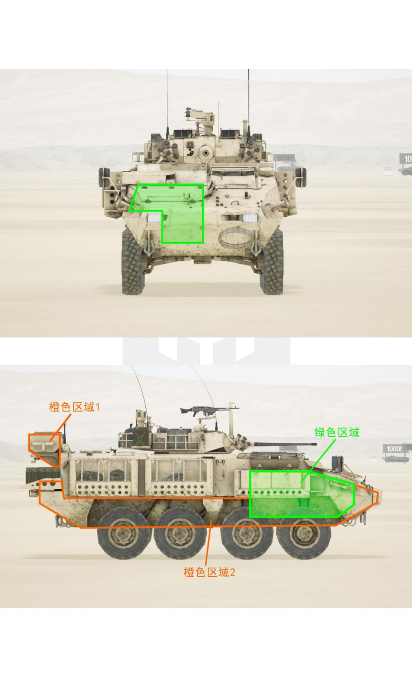
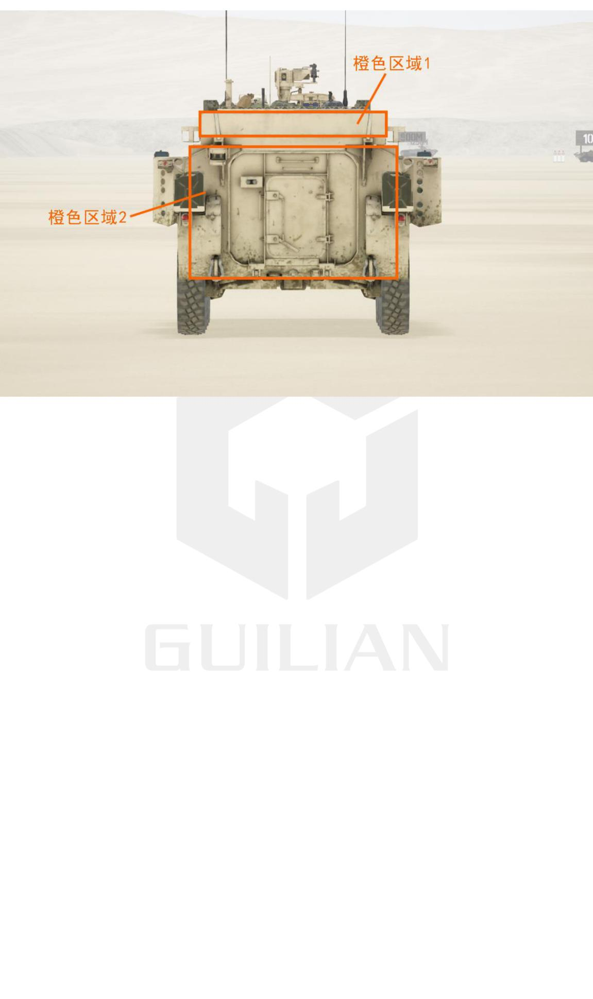

# LAV 6.0


想当 Squad 服主？50 元/月起就能拿下入门款专属服务器！[南赛云](https://server.squadovo.cn/)是高性价比开服首选，低价不低质，让您轻松启动专属战局，低成本圆服主梦～


LAV 6.0 是由加拿大通用动力陆地系统为加拿大武装部队开发的 LAV III 轮式装甲车的增强版。

## 基本数据

| 数据名称     | 值        |
| -------- | -------- |
| 载具血量     | 1750     |
| 最大载员人数   | 13       |
| 最大载弹量    | 600      |
| 是否为两栖载具  | 是        |
| 是否具备 STA | 是        |
| 瞄具可缩放倍数  | 1.5x、12x |
| 价值兵力点    | 10       |
| 炮塔血量     | 600（包含在总血量内） |
| 理论射速     | 200 RPM   |
| 备弹       | AP/HE：75/200 |
| 穿深       | AP/HE：95/8 |

## 装备的阵营

* [CAF | 加拿大武装部队](../../../team/caf.md)

## 武器数据



* 子弹数量：75 x1
* 射击间隙：0.3s
* 装填时间：12.5s
* 最大穿深：95
* 最大伤害：400
* 爆炸伤害：0
* 安全距离：0m



* 子弹数量：200 x1
* 射击间隙：0.3s
* 装填时间：12.5s
* 最大穿深：8
* 最大伤害：100
* 爆炸伤害：125
* 安全距离：0m



* 子弹数量：440 x2
* 射击间隙：0.07s
* 装填时间：11.28s
* 最大穿深：7
* 最大伤害：86
* 爆炸伤害：0
* 安全距离：0m



* 子弹数量：2 x1
* 射击间隙：1s
* 装填时间：1s
* 最大穿深：0
* 最大伤害：0
* 爆炸伤害：0
* 安全距离：0m



## 载具对抗指南

### 弱点分析

- **正面：** LAV6 是前置发动机，从前面看面积较小，战斗中被伤到的概率要小不少。
- **侧面：** LAV6 没有弹药架，侧面只可见绿色区域发动机，橙色区域 1 和橙色区域 2 可被 12.7 打穿。
- **后面：** 橙色区域 1 和橙色区域 2 可被 12.7 打穿。新版本 LAV6 向后的俯角被限制，已经无法自己打炸自己，但橙色区域 1 工具箱仍可被 12.7 造成伤害。

### 载具玩法

1. LAV6 拥有所有轮战中最高的血量（1750），配备布莱德利同款 25mm 机炮，单发伤害和穿深都很顶，但射速慢且穿甲载弹量低仅有 75 发，容错率不高，要尽量节省，用在敌方步战车等高价值目标上，低价值的载具可以选择性忽略。
2. LAV6 动力不错、机动性比较强，但仅有一门机炮锁死了它的上限，因此尽量与低位载具对战（如 BTR-82A）。对方有高位步战车时不要无信息乱跑，容易暴毙，应等待己方步兵给信息打突袭，战斗中死盯着敌方炮塔打，较高的血量会是你的后盾。
3. 受制于橙色区域 1 的长条状箱子，LAV6 无法向后平射，应对后方来敌的反应时间很长（需要等驾驶员转向），因此驾驶员要尽量将车头对准可能有敌人出现的方向。

### 对抗建议

1. 坦克打 LAV6 随便打，LAV6 没有携带任何导弹，仅有一门 25mm 机炮，虽然拥有轮战中最高血量（1750），对坦克来说也只是多打一炮的事儿，当然还是建议先打炮塔，以防 LAV6 临死反扑将你的履带洗断。
2. 带导弹的步战车，大致可参考布莱德利篇。
3. 不带导弹的步战车，则锁定攻击 LAV6 的炮塔。LAV6 基础血量占优势，硬拼不是明智之举，锁炮塔伤害更高的同时也可使它丧失反击能力，同时可充分利用 LAV6 不能向后打的缺点从后方偷袭。正面对上时如若条件允许，可以攻击其引擎并转移至 LAV6 屁股后，这样能把他当陀螺抽。
4. 只有 12.7mm（.50）重机枪的载具（如 M1126 斯崔克），正面遇到 LAV6 能跑就跑。LAV6 炮塔 360°全防 12.7，正面车体同样全防，只有侧面橙色区域 2 不覆盖装甲的区域和后面橙色区域 3 可以造成有效伤害。不过实战中很难有机会，只可配合友军袭扰，不要直接冲上去单挑。

### 图示

<figure><figcaption>正视图与侧视图</figcaption></figure>

<figure><figcaption>后视图</figcaption></figure>

## 载具实图

<figure><figcaption></figcaption></figure>

<figure><figcaption></figcaption></figure>
