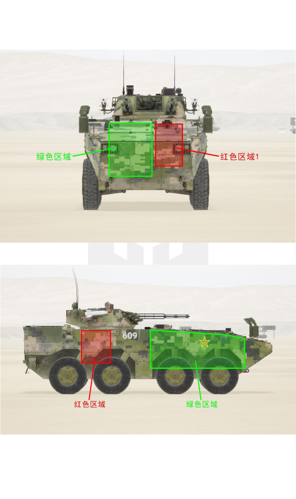
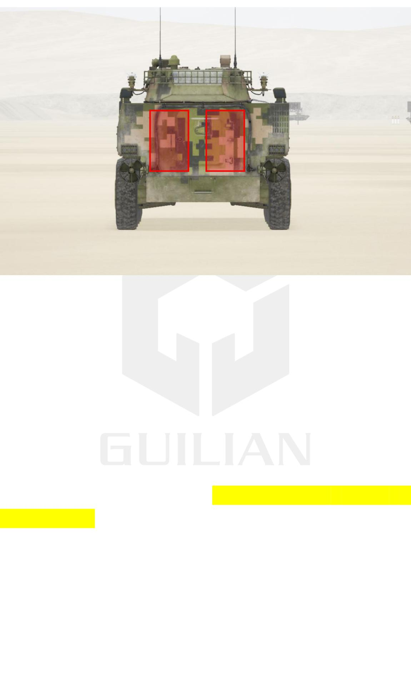

# ZBL08


想当 Squad 服主？50 元/月起就能拿下入门款专属服务器！[南赛云](https://server.squadovo.cn/)是高性价比开服首选，低价不低质，让您轻松启动专属战局，低成本圆服主梦～


ZBL08 是中华人民共和国自主研制的一种 8×8 驱动形式的轮式两栖模块化装甲车族

## 基本数据

| 数据名称     | 值     |
| -------- | ----- |
| 载具血量     | 1250  |
| 最大载员人数   | 10    |
| 最大载弹量    | 600   |
| 是否为两栖载具  | 是     |
| 是否具备 STA | 是     |
| 瞄具可缩放倍数  | 2x、8x |
| 价值兵力点    | 10    |
| 炮塔血量     | 600（包含在总血量内） |
| 理论射速     | 330 RPM |
| 备弹       | AP/HE/GM：160/300/2 |
| 穿深       | AP/HE/GM：105/8/500 |

## 装备的阵营

* [PLA | 中国人民解放军](../../../team/pla.md)

## 武器数据



* 子弹数量：160 x1
* 射击间隙：0.18s
* 装填时间：11.28s
* 最大穿深：105
* 最大伤害：300
* 爆炸伤害：0
* 安全距离：0m



* 子弹数量：300 x1
* 射击间隙：0.18s
* 装填时间：11.28s
* 最大穿深：8
* 最大伤害：100
* 爆炸伤害：125
* 安全距离：0m



* 子弹数量：3000 x1
* 射击间隙：0.0856s
* 装填时间：11.28s
* 最大穿深：7
* 最大伤害：97
* 爆炸伤害：0
* 安全距离：0m



* 子弹数量：2 x1
* 射击间隙：1s
* 装填时间：1s
* 最大穿深：0
* 最大伤害：0
* 爆炸伤害：0
* 安全距离：0m



* 子弹数量：2 x1
* 射击间隙：3s
* 装填时间：12s
* 最大穿深：500
* 最大伤害：1800
* 爆炸伤害：153
* 安全距离：123m



## 载具对抗指南

### 弱点分析

- **正面：** 08 是前置发动机，但这并没有为其带来更多防御力，因为发动机完全没有保护住弹药架。08 的正面皆可被机炮打穿，甚至可以从正面伤到弹药架。
- **侧面：** 绿色区域面积巨大的发动机使得 08 十分容易被击中发动机失去动力。红色区域的弹药架也几乎没有任何防护，位置在后两轮上方靠前、炮塔正下，高度为车体的中上部，坦克可以一炮打穿。
- **后面：** 后面的红色区域可以看到 08 和布莱德利一样是双弹药架，面积很大几乎铺满了整个车后。

### 载具玩法

1. 08 拥有所有步战车中最好的机炮性能和最舒服的驾驶视野，火力强大，在机炮对拼中很占优势。
2. 08 导弹外置，哪怕弹药架被击穿也不影响击发。
3. 08 的两发导弹在静止发射时无法同时控制，第一枚导弹命中目标前将第二枚击发，第一发将失去制导乱飞。
4. 08 的导弹飞行速度过慢，十分依赖先手开火，不然就可能出现敌人的导弹都已经击中你了、你的导弹才飞了一半多的尴尬场面。
5. 08 的 30mm 机炮伤害、穿深和火力持续性均十分优秀，虽然单发伤害和穿深不及 25mm 机炮，但射速快且过热较慢，秒伤反而比 25mm 机炮高，任何步战车和 08 纯拼机炮火力都得先掂量掂量。
6. v9.0 后的 08 十分容易翻车，哪怕只碰到一个很小的石头都可能四脚朝天，驾驶员要格外小心；注意 v9.0 后的红箭 73 不再支持断线。

### 对抗建议

1. v9.0 后 08 不再支持断线红箭，对坦克的威胁下降不少，找机会偷袭才是王道。
2. 带导弹的步战车，大致可参考布莱德利篇。
3. 不带导弹的步战车，则锁定攻击 08 的炮塔。08 的红箭 73 击发和飞行速度都很慢，抓紧这个短暂的时间尽量削减其炮塔血量。
4. 只有 12.7mm（.50）重机枪的载具（如 M1126 斯崔克），正面遇到 08 能跑就跑。08 和 04 一样炮塔 360°全防 12.7，车体同样全防，侧面和后面车体可以造成有效伤害，但无法伤到发动机和弹药架。

### 图示

<figure><figcaption>正视图与侧视图</figcaption></figure>

<figure><figcaption>后视图</figcaption></figure>

## 载具实图

<figure><figcaption></figcaption></figure>

<figure><figcaption></figcaption></figure>
