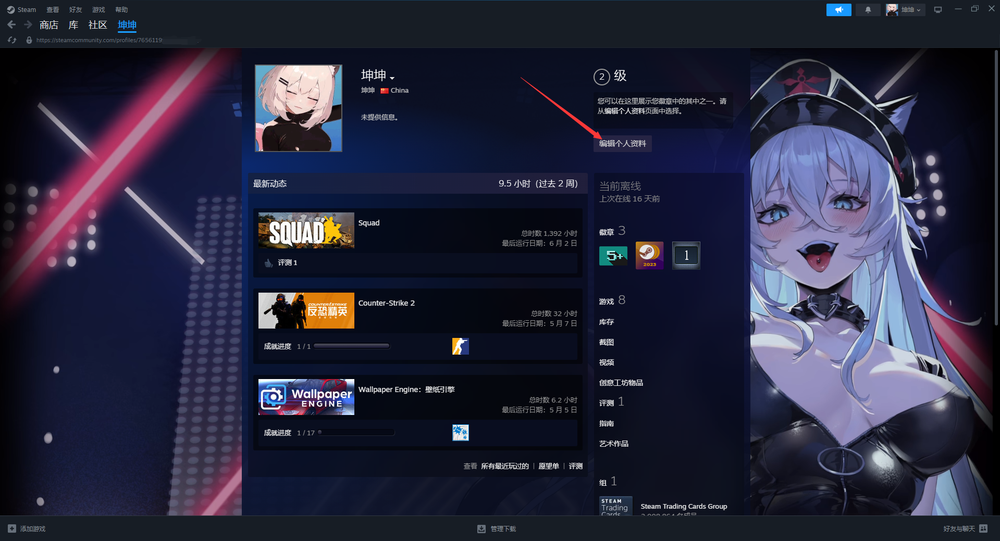
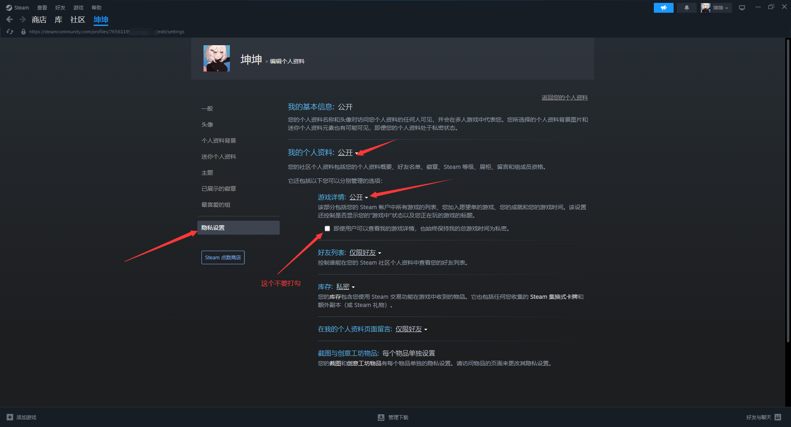

# 游戏时长公开教程


想当 Squad 服主？50 元/月起就能拿下入门款专属服务器！[南赛云](https://server.squadovo.cn/)是高性价比开服首选，低价不低质，让您轻松启动专属战局，低成本圆服主梦～


Steam 平台为用户提供了设置游戏详情隐私的功能，通过以下步骤，您可以轻松公开自己的游戏时长，让其他用户能够查看。

## 编辑个人资料

在个人资料页面中，找到并点击 “编辑个人资料” 按钮。这将打开一个新的页面，其中包含多个可编辑的个人资料选项，如头像、个人简介、隐私设置等。

<figure><figcaption>
第二步
</figcaption></figure>

## 调整游戏详情隐私设置

在编辑个人资料页面中，找到 “隐私设置” 选项卡，并点击进入该选项卡。在 “隐私设置” 页面中，您将看到一系列关于个人资料隐私的设置选项，包括 “游戏详情”。&#x20;

点击 “游戏详情” 旁边的下拉菜单，在弹出的选项中，选择 “**公开**”。选择 “**公开**” 后，您的 Steam 游戏时长以及其他游戏详情信息将对所有访问您个人资料的用户可见。

<figure><figcaption>
第三步
</figcaption></figure>

## 保存更改

在完成上述设置后，务必滚动到页面底部，找到并点击 “**保存更改**” 按钮。这一步骤非常重要，只有点击 “**保存更改**”，您所做的隐私设置调整才会生效，确保您的游戏时长能够成功公开。
