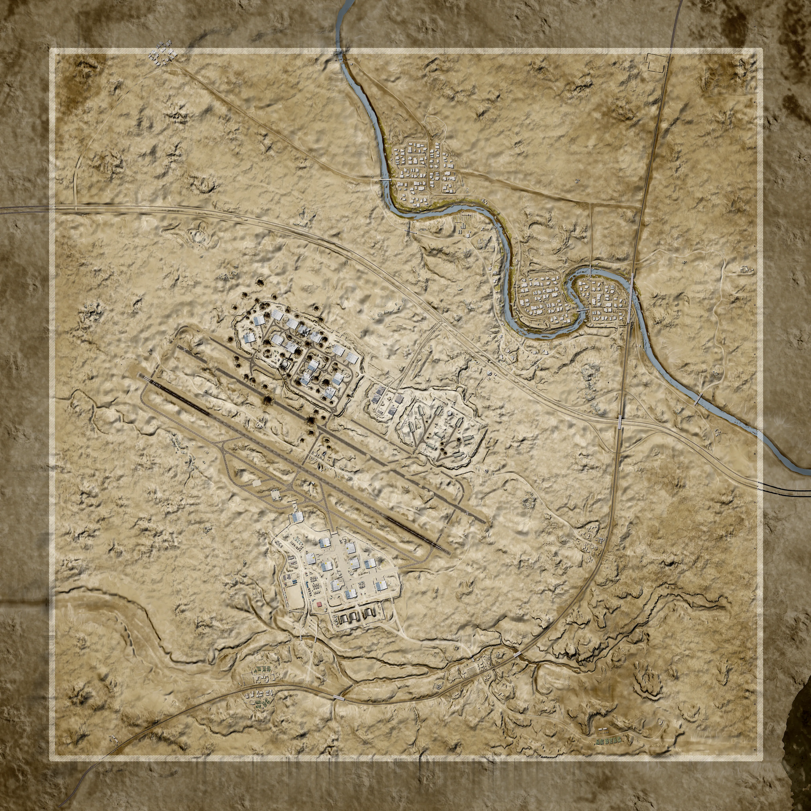
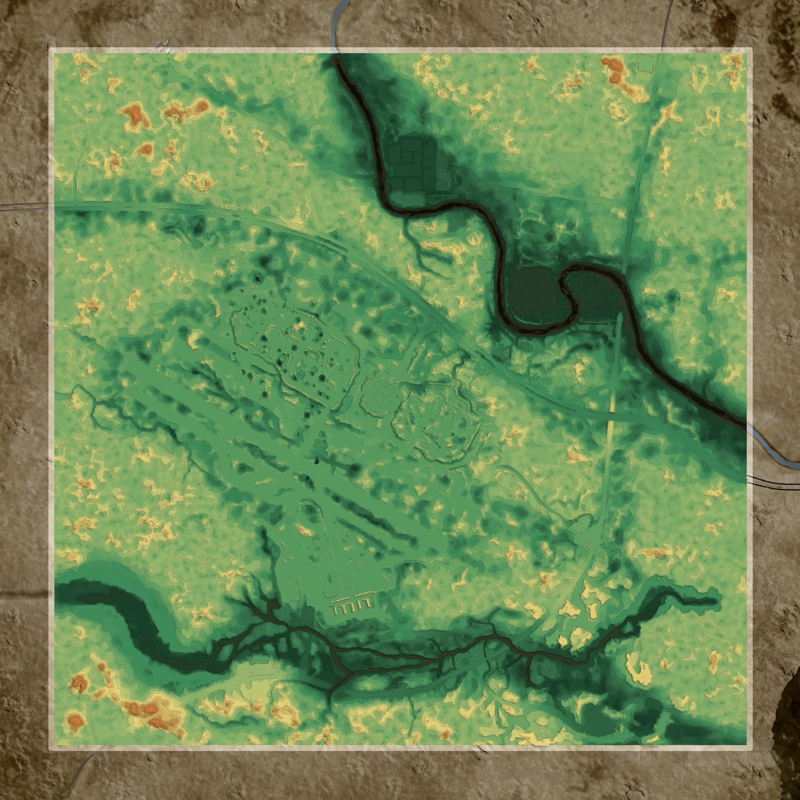

# Tallil Outskirts | 塔利尔郊区


想当 Squad 服主？50 元/月起就能拿下入门款专属服务器！[南赛云](https://server.squadovo.cn/)是高性价比开服首选，低价不低质，让您轻松启动专属战局，低成本圆服主梦～


<figure><figcaption></figcaption></figure>

前塔利尔空军基地曾为伊拉克空军所用，其特色是拥有大型混凝土飞机库和防御工事。这里大部分地形为开阔的沙漠，尽管该地区零星分布着几个村庄，但最终哪一方能够获胜，将取决于装甲部队与机械化步兵的协同作战。

## 介绍

这张地图以塔利尔空军基地为原型，展现了其在 20 世纪 80 年代两伊战争、90 年代海湾战争中于伊拉克南部地区的历史角色，以及如今作为伊美联合空军基地的现状。地图最显著的特征是其庞大的飞机掩体和防御工事，周围环绕着开阔的沙质沙漠、岩石露头和村庄。地图聚焦于车载战斗，但与装甲部队协同作战的步兵小队也将在塔利尔的战场上大显身手。

## 地图大小

4000 x 4000 米（16 平方公里）

## 位置

[伊拉克 纳西里耶](https://zh.wikipedia.org/wiki/%E7%BA%B3%E8%A5%BF%E9%87%8C%E8%80%B6)

## 地形图

<figure><figcaption></figcaption></figure>

## 地势图

<figure><figcaption></figcaption></figure>
