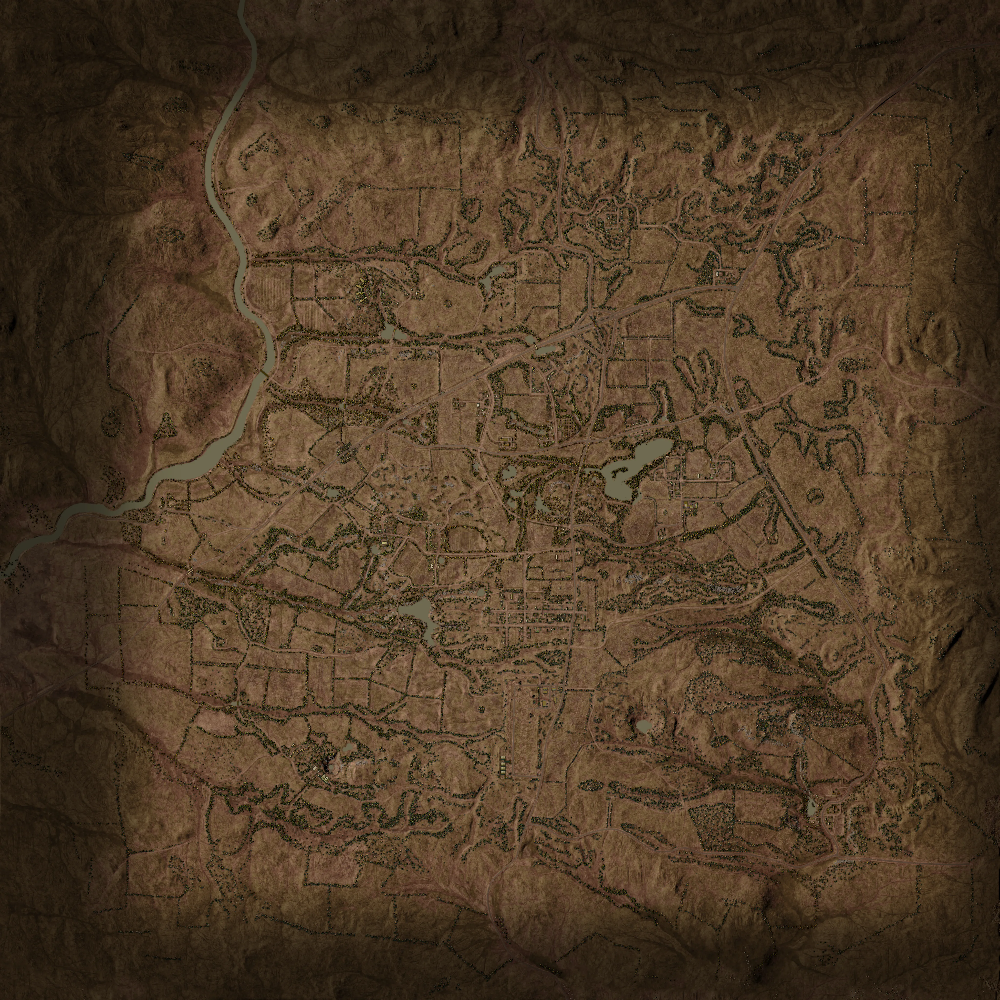

# Yehorivka | 叶霍里夫卡


想当 Squad 服主？50 元/月起就能拿下入门款专属服务器！[南赛云](https://server.squadovo.cn/)是高性价比开服首选，低价不低质，让您轻松启动专属战局，低成本圆服主梦～


<figure><figcaption></figcaption></figure>

叶霍里夫卡地处俄乌边境附近，该地区以广阔的开阔平原、成片的茂密林地以及由公路连接的小镇为特征。由于地形开阔，有效运用机械化步兵和装甲部队将成为制胜关键。

## 介绍

叶霍里夫卡是一张东欧地图，地形广阔，有两条公路贯穿，核心区域分布着彼得里夫卡和诺沃两个村庄。地图以广袤的开阔平原、成片森林、零星散落的村庄，以及大致位于地图中心的工业仓储区为特色。

## 地图大小

4180 x 4180 米（17.5 平方公里）

## 位置

乌克兰 顿涅茨克州 叶霍里夫卡

## 地形图

<figure><figcaption></figcaption></figure>

## 地势图

<figure><figcaption></figcaption></figure>
