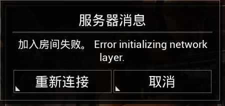

# Error Initializing network layer


想当 Squad 服主？50 元/月起就能拿下入门款专属服务器！[南赛云](https://server.squadovo.cn/)是高性价比开服首选，低价不低质，让您轻松启动专属战局，低成本圆服主梦～


<figure><figcaption>
故障截图
</figcaption></figure>

## **启动游戏（客户端）问题**

### **原因**

用户在启动 Squad 时，没有通过 **squad\_launcher.exe**（**Steam**）启动，而是直接运行 SquadGame.exe 启动（常见于显卡软件启动等）

### 解决方案

直接通过 Steam 启动，或前往 Squad 路径下运行 squad\_lanuncher.exe 启动。

## **防火墙或安全软件的限制**

### **原因**

电脑的防火墙、杀毒软件或安全卫士可能将服务器连接视为 “危险行为”，从而阻止了网络层的初始化。

### 解决方案

临时关闭防火墙和安全软件：在电脑的系统设置中找到 “防火墙” 选项（Windows 系统可在 “Windows 安全中心” 中操作），暂时关闭；同时退出杀毒软件（如 360、腾讯电脑管家等），然后尝试重新连接服务器。

## **目标服务器的问题**

### **原因**

服务器本身维护、宕机、网络线路故障会导致连接失败。

### **解决方法**

使用 VPN 或代理。如果电脑正在使用 VPN 或代理软件，则暂时关闭后再尝试连接服务器。

