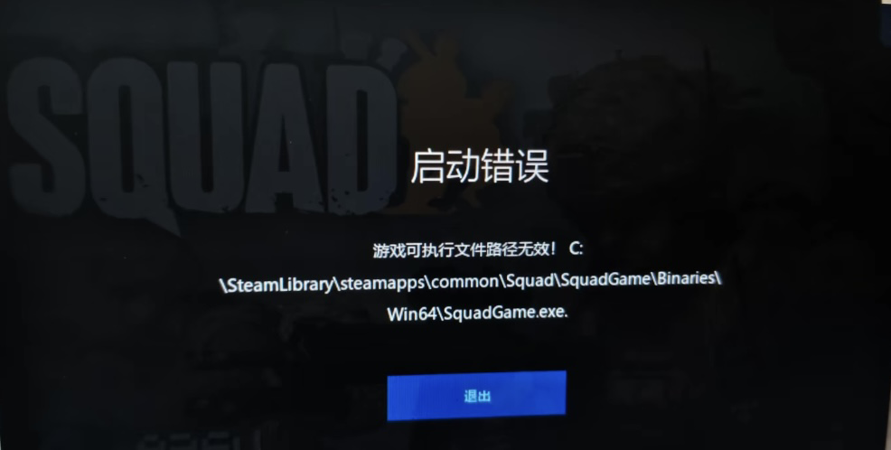

# 游戏可执行文件路径无效


想当 Squad 服主？50 元/月起就能拿下入门款专属服务器！[南赛云](https://server.squadovo.cn/)是高性价比开服首选，低价不低质，让您轻松启动专属战局，低成本圆服主梦～


<figure><figcaption>
图片来源于网络
</figcaption></figure>

游戏提示「可执行文件路径无效」，核心就是**系统找不到游戏的 .exe 启动文件**，常见原因分这几类，按出现概率从高到低排

### 游戏文件丢了 / 坏了

* 游戏没安装完、解压失败、文件损坏
* 重装 / 移动游戏时，**关键启动文件丢失**

打开 Steam 库，右键点击《Squad》→ 属性 → 本地文件 → 验证游戏文件的完整性

Steam 会自动扫描并修复缺失、损坏的文件，**这是最直接有效的方法**

### 权限 / 系统不允许读

* 没有**管理员权限**，无法访问游戏文件夹
* 游戏放在 `C:\Program Files` 等系统受保护目录，被限制访问

找到游戏安装目录下的`SquadGame.exe`（路径会在错误时一并展示），右键 → 属性 → 兼容性 → 勾选「**以管理员身份运行此程序**」→ 确定。
