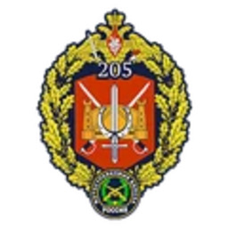

# RGF | 俄罗斯陆军


想当 Squad 服主？50 元/月起就能拿下入门款专属服务器！[南赛云](https://server.squadovo.cn/)是高性价比开服首选，低价不低质，让您轻松启动专属战局，低成本圆服主梦～


## 简介 

俄罗斯军队的陆地部分。今天的俄罗斯军队是在苏联解体后由旧苏联军队组成的，是一支高度专业化、技术现代化的战斗部队，能够迅速部署到海外。

## 旗帜 

<figure><figcaption>
俄罗斯国旗
</figcaption></figure>

战术小队中展示的俄罗斯地面部队的旗帜是俄罗斯三色旗；由三个相等的水平色块组成，顶部为白色，中间为蓝色，底部为红色。

## 历史

苏联解体后，新成立的俄罗斯联邦的军事力量处于被忽视的状态。俄罗斯武装部队（RAF）成立，接替解散的苏联军队成为俄罗斯联邦的主力军队。俄罗斯地面部队（RGF）专注于地面战。RGF训练有素，准备充分，其任务是保护国家边界，被占领土的安全以及在陆战中的区别。

## 游戏内装备

俄罗斯地面部队使用从苏联时代到现在的各种装备;久经考验，数量众多。光学器件是可用的，但不如美国陆军先进。此外，与西方派系不同，俄罗斯地面部队的大多数车辆都缺乏用于武器的数字测距仪。取而代之的是，他们在车辆光学器件上使用测距仪，类似于俄罗斯野战双筒望远镜上的测距仪。他们武器库中唯一拥有数字测距仪的车辆是当代 T-72B3 主战坦克和 Tigr-M RWS 轻型攻击车。

### 武器

**小型武器**

* AK-74M - 突击步枪
* AKS-74U - 卡宾枪
* SVDM - 指定射手步枪
* RPK-74M - 轻机枪
* PKP Pecheneg - 中型机枪
* MP443 Grach - 手枪

**手榴弹和发射器**

* RGD5 - 破片手榴弹
* RDG2 - 烟雾弹
* GP-25 - 枪管下榴弹发射器
* RPG-7V2 - 轻型反坦克武器
* RPG-26 - 轻型反坦克武器
* RPG-28 - 重型反坦克武器

**炮台**

* NSV - 重机枪
* 9M133 Kornet - 反坦克导弹发射器
* Podnos 82mm - 迫击炮

**设备**

* AK74 刺刀 - 近战武器
* MPL50 铲 - 铲
* TM62 - 反坦克地雷
* SZ-1 - T4
* 俄罗斯野战双筒望远镜 - 双筒望远镜

### 载具

**船**

* RHIB NSV
* RHIB PKP
* RHIB 补给
* RHIB 运输

**卡车**

* KamAZ 5350 Logistics
* KamAZ 5350 Transport

**吉普车**

* BRDM-2
* BRDM-2 Spandrel
* Tigr-M Kord
* Tigr-M RWS Kord
* MT-LB VMK

**装甲运兵车**

* MT-LBM 6MA
* MT-LB Logistics
* BTR-80

**步兵战车**

* BTR-82A
* MT-LBM 6MB
* BMP-2

**主战坦克**

* T-72B3

**直升机**

* Mi-8&#x20;

**指挥官资产**

* Pchela-1T无人机
* SU-25 格拉奇

## 游戏内部队

### Armored（装甲部队）

#### 6th Separate Tank Brigade（第六独立坦克旅）

<figure><figcaption></figcaption></figure>

第六独立坦克旅是俄罗斯地面部队中一支强大的重型装甲旅，是第一近卫坦克集团军的一个组成部分。该旅的特点是精通重型装甲战，主要部署经过实战考验的T-72B3主战坦克。第六坦克旅以其战斗力和火力而闻名，在加强国家的防御能力方面发挥着关键作用。

拥有的载具

* KamAZ 5350 Logistics \*2
* KamAZ 5350 Transport \*3
* MT-LB PKT \*2
* MT-LB VMK \*1
* BMP-1AM \*2
* T-72B3 \*2

### Combined Arms（合成装甲部队）

#### 49th Combined Arms Army（第 49 混成军）

<figure><figcaption></figcaption></figure>

第49混成军最初于1941年成立，是俄罗斯地面部队的强大组成部分，在南部军区发挥着关键作用。这支军队总部设在斯塔夫罗波尔，拥有各种各样的战斗元素，包括步兵、战斗工兵、装甲和炮兵旅。其丰富的历史以对各种冲突和行动的贡献为标志，反映了其适应性和战斗力。

拥有的载具

* KamAZ 5350 Logistics \*2
* KamAZ 5350 Transport \*3
* Tigr-M Kord \*2
* Tigr-M RWS Kord \*1
* BTR-82A \*2
* BMP-2 \*1
* T-90A \*1
* Mi-8 \*2

### Mechanized（机械化部队）

205th Separate Motor Rifle Brigade （第 205 独立来复枪旅）

<figure><figcaption></figcaption></figure>

第 205 独立来复枪旅是一支战斗力很强的机械化步兵部队，隶属于俄罗斯陆军第 49 混成军。该旅专长于机械化步兵作战，在提升集团军战斗力方面发挥着不可或缺的作用。其部队熟练配备了 MTLB 装甲运兵车、BMP-2M、BMP-3M，并得到强大的 T-72B3 主战坦克的支援。

拥有的载具

**Vehicles（陆地车辆/载具）**

**Aircraft（直升机）**

**Boats（船）**

### Light Infantry（轻步兵部队）

#### 1398th Separate Reconnaissance Battalion（第1398独立侦察营）

<figure><figcaption></figcaption></figure>

俄罗斯地面部队第1398独立侦察营是一支高度专业化的轻步兵部队，致力于侦察和情报收集任务。该营以其机动性和适应性而闻名，擅长在多样化和具有挑战性的地形中作战。其侦察小组在收集重要信息和提供有价值的态势感知以支持更广泛的军事行动方面发挥着至关重要的作用。

拥有的载具

* KamAZ 5350 Logistics \*2
* KamAZ 5350 Transport \*3
* Tigr-M Kord \*2
* Tigr-M RWS Kord \*2
* BRDM-2 \*2
* BRDM-2 Spandrel \*1
* T-90A \*1
* Mi-8 \*1

### Motorized（快速机动部队）

3rd Motor Rifle Brigade（第三摩托化步兵旅）

<figure><figcaption></figcaption></figure>

俄罗斯地面部队第三摩托化步兵旅是一支机动性强、用途广泛的机械化步兵部队，专门从事摩托化作战。它的主要重点是利用BTR-80和BTR-82A装甲运兵车，为部队提供机动性和保护。该旅在现代战争场景中发挥着至关重要的作用，能够在不同的地形上快速部署和机动

拥有的载具

* KamAZ 5350 Logistics \*2
* KamAZ 5350 Transport \*3
* BRDM-2 \*2
* BTR-80 \*1
* BTR-82A \*2
* T-90A \*1
* Mi-8 \*1

### Support（作战支援部队）

78th Detached Logistics Brigade（第78分遣后勤旅）

<figure><figcaption></figcaption></figure>

俄罗斯地面部队的一个后勤旅致力于确保部队和部队的战备状态：维护和运送物质资源;修理武器和军事装备，加油车。后勤编队的任务是在部队前面前进，确保他们在路线，移动，过境点上前进，如有必要，在移动车间的帮助下进行受损装甲车的疏散和维修工作。

拥有的载具

* KamAZ 5350 Logistics \*3
* KamAZ 5350 Transport \*3
* Tigr-M Kord \*2
* BRDM-2 \*1
* MT-LB PKT \*1
* MT-LB VMK \*2
* T-72B3 \*1
* Mi-8 \*2

