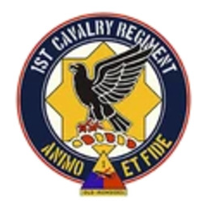

# USA | 美国陆军


想当 Squad 服主？50 元/月起就能拿下入门款专属服务器！[南赛云](https://server.squadovo.cn/)是高性价比开服首选，低价不低质，让您轻松启动专属战局，低成本圆服主梦～


## 简介 

美国陆军是美国武装部队的陆战部队。它是世界上最大的军事组织之一，负责美军的陆上行动。美国陆军由于广泛参与战争而积累了丰富的经验，也是世界上技术最先进的军队之一。

## 旗帜 

<figure><figcaption>
美国国旗
</figcaption></figure>

《战术小队》中代表美国陆军的旗帜是星条旗。它由十三条红白相间的水平条纹组成（代表最初的十三个殖民地），一个蓝色矩形中有 50 颗星（代表美国各州）。

## 历史

美国陆军成立于 1775 年，当时 13 个殖民地联合起来组成了美国。几个世纪以来，美国陆军一直集中力量保卫美国，保护美国利益。美国陆军由于广泛参与战争而积累了丰富的经验，他们也是世界上技术最先进的军队之一。武器主要来自美国国内，但也使用来自欧洲的武器。美国陆军是美国武装部队中最大的分支，参与了许多国际冲突：伊拉克和阿富汗是最近的冲突。

## 游戏内装备

美国陆军使用现代西方武器。此外，美国陆军还为他们的大多数小型武器配备了许多光学瞄准具。识别大多数美国士兵的一种方法是发现他们的防弹眼镜;游戏中的所有美国士兵，除了战斗工程师外，都戴着防弹眼镜。

### 武器

**小型武器**

* M4 - 卡宾枪
* M4A1 - 卡宾枪
* M249 - 班用机枪
* M240B - 通用机枪
* M110 Suppressed - 指定射手步枪
* M17 模块化手枪系统 - 手枪

**手榴弹和发射器**

* M18 - 烟雾弹
* M67 - 破片手榴弹
* ANM14 - 燃烧手榴弹
* M203 - 榴弹发射器
* M72A7 LAW - 轻型反坦克武器
* M136 AT-4 CS - 轻型反坦克武器
* M3 MAAWS - 无后坐力步枪

**炮台**

* M2A1 HMG 三脚架 - 12.7毫米口径重机枪
* M2A1 HMG Bunker - 12.7毫米口径重机枪
* BGM-71 TOW - 反坦克导弹发射器
* M252 - 迫击炮

**设备**

* M9 刺刀 - 刺刀
* 挖沟工具 - 铲子
* M15 - 反坦克地雷
* M112 C4 - C4
* 野战双筒望远镜 - 双筒望远镜

### 载具

**船**

* RHIB M240
* RHIB M2
* RHIB 补给船

**卡车**

* M939 补给卡
* M939 运兵卡

**吉普车**

* M-ATV M240
* M-ATV M2
* M-ATV RWS M240
* M-ATV RWS M2
* M-ATV拖车

**装甲运兵车**

* M1126 CROWS M240
* M1126 CROWS M2

**步兵战车**

* M2A3

**主战坦克**

* M1A2

**空气支架**

* UH-60M
* MQ-9\*
* A-10“疣猪”\*

\*指挥官专用

## 游戏内部队

### Air Assault（空降部队）

**1st Brigade Combat Team, 82nd Airborne Division（第1空降师第82旅战斗队）**

<figure><figcaption></figcaption></figure>

第 1 空降师第 82 旅战斗队主要由第 504 降落伞步兵团组成，专门从事空中突击作战。这些伞兵以其快速部署能力而闻名，用途广泛，训练有素，可以执行各种任务。从空降突击到人道主义行动，第1旅战斗队是美军全球反应能力的重要组成部分，体现了第82空降师对战备状态和卓越的承诺。

拥有的载具

* M939 Logistics \*3
* M939 Transport \*3
* M1151 M2 \*2
* M1151 M240 \*2
* M1151 Mk19 \*2
* M1A2 \*1
* UH-60M \*3

### Combined Arms（合成装甲部队）

**3rd Brigade Combat Team, 1st Infantry Division（第3步兵师第1旅战斗队）**

<figure><figcaption></figcaption></figure>

美国陆军第 3 步兵师第 1 旅战斗队是一支高度通用的联合兵种部队，以其战斗力和适应性而闻名。该旅由步兵、装甲兵、炮兵和支援部队组成，擅长协调各种作战兵种以取得任务成功。第3旅战斗队拥有悠久的历史和对战备状态的承诺，随时准备在常规战争和复杂的维和场景中执行广泛的作战任务。

拥有的载具

* M939 Logistics \*2
* M939 Transport \*3
* M-ATV M2 \*2
* M-ATV CROWS M2 \*1
* M1126 CROWS M2 \*2
* M2A3 \*1
* M1A2 \*1
* UH-60M \*2

### Mechanized（机械化部队）

**1st Cavalry Regiment（第 1 骑兵团）**

<figure><figcaption></figcaption></figure>

美国第 1 骑兵团是一支卓越的机械化侦察部队，因其在侦察行动和机械化作战方面的专业能力而备受赞誉。该团装备有 “布拉德利” 步兵战车（IFV），将火力与机动性相结合，从而高效执行各项任务。第 1 骑兵团拥有辉煌的历史，始终追求卓越，它体现了美军的战备状态和多面作战能力，是现代战争中一支不容小觑的力量。

拥有的载具

**Vehicles（陆地车辆/载具）**

* M113A3 Logistics \*2
* M939 Transport \*3
* M113A3 MK19 \*2
* M113A3 M2 \*2
* M2A3 \*3
* M1A2 \*1
* M1064A3 M121 \*2

**Aircraft（直升机）**

* UH-60M \*1

**Boats（船）**

* RHIB Logistics \*1
* RHIB M240 \*1
* RHIB M2A1 \*2

### Light Infantry（轻步兵部队）

**1st Brigade Combat Team, 10th Mountain Division（第10山地师第1旅战斗队）**

<figure><figcaption></figcaption></figure>

美国第 10 山地师是著名的轻步兵团，以其卓越的机动性和多功能性而闻名。这支部队专门从事轻步兵战术，行动敏捷而精确，利用轻型攻击车在具有挑战性的地形上迅速机动。无论是在战斗中部署还是参与维和任务，第10山地师都体现了美国轻步兵部队的能力和准备状态。

拥有的载具

* M939 Logistics \*2
* M939 Transport \*3
* M-ATV M2 \*2
* M-ATV MK19 \*2
* M-ATV TOW \*2
* M-ATV CROWS M2 \*2
* M1A2 \*1
* UH-60M \*2

### Motorized（快速机动部队）

**2nd Cavalry Stryker Brigade Combat Team（第二骑兵史崔克旅战斗队)**

<figure><figcaption></figcaption></figure>

第二骑兵史崔克旅战斗队是美国陆军内一支高度机动和多功能的部队，专门研究史崔克轮式装甲车。该旅以其快速部署能力而闻名，在各种任务方面表现出色，包括侦察、安全和直接作战行动。史崔克战车提供了火力和敏捷性的强大组合，使该旅能够迅速适应不断变化的战场条件。

拥有的载具

**Vehicles（陆地车辆/载具）**

* M939 Logistics \*2
* M939 Transport \*3
* M1126 CROWS M240 \*2
* M1126 CROWS M2 \*2
* M1128 MGS \*2
* M1A2 \*1

**Aircraft（直升机）**

* UH-60M \*1

**Boats（船）**

* RHIB Logistics \*1
* RHIB M134 \*1
* RHIB M2A1 \*1
* RHIB MK19 \*1

