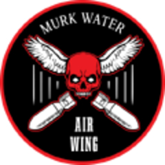
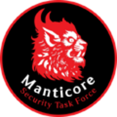
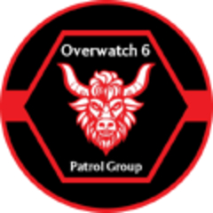

# WPMC | 西部私人军事承包商


想当 Squad 服主？50 元/月起就能拿下入门款专属服务器！[南赛云](https://server.squadovo.cn/)是高性价比开服首选，低价不低质，让您轻松启动专属战局，低成本圆服主梦～


## 简介

西部私人军事承包商 （WPMC） 专注于非标准化的现代步兵。虽然他们可能缺乏其他常规部队所拥有的一些工具，例如重型车辆和重型武器，但他们用速度、敏捷性和步兵火力弥补了这一点。

## 旗帜

<figure><figcaption></figcaption></figure>

WPMC 旗帜上有一只白色的鹰头，背景为红色，由红色十字准线穿过。国旗的背景是黑色的。

## 历史

虽然 WPMC 没有以特定国家为蓝本，但人们推测它是以英国或美国的承包商为蓝本的，例如 Constellis Holdings（更广为人知的是 Blackwater）。

## 游戏内装备

Western PMC 混合使用西方购买的武器，其中大部分是中短距离瞄准镜。他们非常强调反步兵能力，使用手持左轮手枪式 MKE MGL 榴弹发射器和各种更小、更敏捷、具有强大压制能力的车辆，如 CPV。

由于缺乏强大的 MBT 和 IFV，该派系在很大程度上依赖于机动性、侦察和伏击才能有效，迫使其进行战略性游戏。

### 武器

**主要武器**

* M4 - 卡宾枪
* M14 - 战斗步枪
* M4 Simon Offense - 短步枪
* AK-101 PushCo - 突击步枪
* M4 Wormpool - 全长步枪
* MP5A3- 冲锋枪
* Minimi - 轻机枪
* HK416 - 中型机枪
* M240B - 通用机械枪
* M16 Wormpool - 指定射手步枪 / 全长步枪
* HK417 - 指定射手步枪
* M21 - 指定射手步枪
* TW 338 SWS - 狙击步枪
* M9A1 - 手枪
* G17 - 手枪
* 勃朗宁 HP - 手枪

**投掷物和反坦克武器**

* M18 - 烟雾弹
* RGO - 破片手榴弹
* M67 - 破片手榴弹
* M320 GLM - 榴弹发射器
* MKE MGL - 多管榴弹发射器
* M72A7 LAW - 反坦克火箭筒
* M136 - 反坦克火箭筒
* Carl Gustav M2 - 无后坐力步枪

**固定火力支援武器**

* M2A1 HMG 三脚架 - 重机枪
* M2A1 HMG 碉堡 - 重机枪
* Mk19 AGL 三脚架 - 自动榴弹发射器
* BGM-71 TOW - 反坦克导弹
* M252 - 迫击炮&#x20;

**设备**

* M9  - 匕首
* 挖沟工具 - 铲子
* M15 - 反坦克地雷
* M112 C4 - C4炸药
* Field Bioculars - 双筒望远镜

### 载具

**卡车**

* M939 Logistics - 补给卡车
* M939 Transport - 运兵卡车

**摩托车**

* Quad Bike - 摩托车

**轻型车辆**

* Technical Logistics - 轻型补给车辆
* Technical Transport  - 轻型运兵车辆
* Technical M134  - 轻型侦察车辆
* Technical M2  - 轻型侦察车辆
* CPV Transport - 轻型运兵车辆
* CPV M134  - 轻型侦察车辆
* M1117 - 装甲车辆
* M1151 M240 - 轻型侦察车辆
* M1151 M2 Browning - 装甲侦察车辆
* M1151 TAO - 高机动反坦克车

**APC**

* M113A3 M2 - 装甲载具
* M113A3 MSV - 移动式重生车

**主战坦克**

* M60T - 主战坦克

**飞机**

* Loach Transport - 运兵直升机
* Loach CAS - 直升机
* CH-146 - 运输直升机

**指挥官专用**

* Handheld Drone - 侦察无人机
* F-16 猎鹰 - 近距离空中支援
* Heavy Mortar Barrage - 重型迫击炮支援

## 游戏内部队

### Air Assault（空降部队）

**Murk Water Air Wing（暗水航空联队）**

<figure><figcaption></figcaption></figure>

**暗水航空联队**是一支专门从事空中突击和侦察行动的特种部队。该空中联队由训练有素的飞行员和机组人员组成，所使用的飞机均为快速部署和精确侦察任务而配备。其机队包括用途广泛的直升机，这些直升机专为在各种不同环境中进行快速人员投送和撤离而设计。墨泽水域空中联队擅长执行高风险的空中突击任务，能够迅速且精准地将精锐部队运送至关键地点。

拥有的载具

### Combined Arms（合成装甲部队）

**Manticore Security Task Force（蝎狮安保特勤队）**

<figure><figcaption></figcaption></figure>

**蝎狮安保特勤队**是一家私营军事公司，旗下运营着一支实力强大的特遣部队，该部队以具备多兵种联合作战能力而闻名。这支部队整合了步兵、装甲部队及支援力量，配备尖端武器和先进技术，能够应对各类军事行动。该特遣部队擅长协同作战，在从常规战争到反叛乱等一系列任务中均展现出高度的灵活性。以高效和实效为核心，曼提柯尔安全特遣部队在私营军事行动领域堪称一支强大且适应性强的力量。

拥有的载具

**Vehicles（陆地车辆/载具）**

* M113A3 MSV \*1
* Technical Logistics \*2
* M939 Logistics \*1
* M939 Transport \*1
* M1151 M2 \*1
* M1117 \*2
* CPV Transport \*4
* CPV M134 \*2
* M113A3 M2 \*1
* M60T \*1
* Technical Mortar \*2
* M1151 TOW \*2

**Aircraft（直升机）**

* Loach Transport \*1
* CH-146 Raven \*2

**Boats（船）**

* RHIB Logistics \*1
* RHIB M134 \*1
* RHIB M2A1 \*1
* RHIB MK19 \*1

### Light Infantry（轻步兵部队）

**Overwatch 6 Patrol Group（守望先锋第六巡逻小组）**

<figure><figcaption></figcaption></figure>

**守望先锋第六巡逻小组**是这家私营军事公司旗下的一支特种部队，主要负责贵宾保护任务，并参与高科技、高机动性的行动。作为一支轻步兵编队，该小组配备了先进且灵活的载具，以便迅速应对安全威胁。他们专长于为重要人物提供近身保护，运用先进战术与技术，确保贵宾在复杂多变的环境中的安全。守望先锋 6 号巡逻小组兼具机动性与高科技能力，是一支充满活力的力量，能够精准且灵活地满足安全需求。

拥有的载具

**Vehicles（陆地车辆/载具）**

* Quad Bike \*9
* M939 Transport \*1
* CPV Transport \*4
* M939 Logistics \*1
* Technical Logistics \*2
* CPV M134 \*3
* Technical M2 \*3
* M1117 \*2
* M1151 TOW \*2
* M113A3 MSV \*1
* Technical Mortar \*2&#x20;
* M60T \*1

**Aircraft（直升机）**

* OH-6 Loach \*1
* CH-146 Raven \*1

