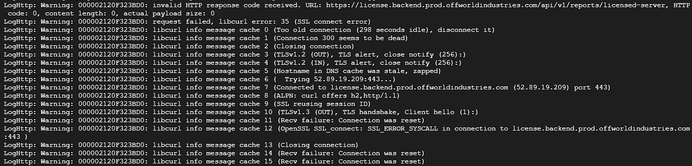

# 连接至认证系统时出现问题


想当 Squad 服主？50 元/月起就能拿下入门款专属服务器！[南赛云](https://server.squadovo.cn/)是高性价比开服首选，低价不低质，让您轻松启动专属战局，低成本圆服主梦～


## 错误日志

<figure><figcaption>
无法连接至认证系统的错误日志截图（非唯一）
</figcaption></figure>

## 排查

请检查您的服务器网络是否允许访问海外服务器（尝试 **Ping 8.8.8.8**）

如果 **Ping 8.8.8.8** 成功，则为DNS污染问题，您需要 [更换 DNS](server-license.md#jie-jue)

## 解决

<table><thead><tr><th>公共DNS服务器名称</th><th width="247">首选DNS</th><th>备用DNS</th></tr></thead><tbody><tr><td><strong>谷歌 DNS</strong></td><td>8.8.8.8</td><td>8.8.4.4</td></tr><tr><td><strong>114 DNS</strong></td><td>114.114.114.114</td><td>114.114.115.115</td></tr><tr><td><strong>阿里Ali DNS</strong></td><td>223.5.5.5</td><td>223.6.6.6</td></tr><tr><td><strong>CloudFlare DNS</strong></td><td>1.1.1.1</td><td>1.1.1.1</td></tr></tbody></table>

更换DNS教程

* 进入“网络和共享中心”：在桌面上右键单击电脑图标，选择“属性”打开属性窗口，在窗口左侧选择“更改适配器设置”，进入网络和共享中心。
* 选择网络连接：在网络和共享中心，选择需要更改DNS服务器的网络连接，右键选择“属性”打开属性窗口。
* 编辑网络属性：在网络属性窗口中，选择“Internet协议版本4（TCP/IPv4）”，点击“属性”按钮。
* 指定DNS服务器：在Internet协议版本4（TCP/IPv4）属性窗口中，“通常自动获取”改为“使用下列DNS服务器地址”，手动输入需要更改的DNS服务器地址，点击“确定”即可完成更改。如需输入备用DNS服务器，可在“备用DNS服务器”中输入备用服务器地址。

我们推荐您使用 **114.114.114.114** 作为首选DNS **8.8.8.8** 作为备选DNS
