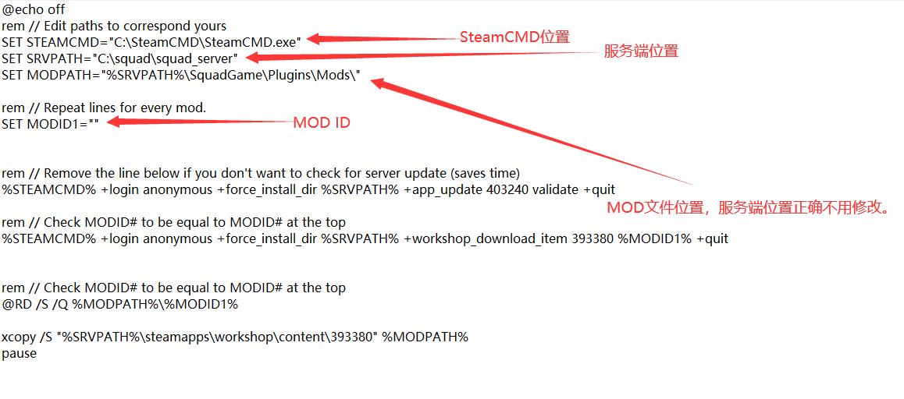

# MOD 安装


想当 Squad 服主？50 元/月起就能拿下入门款专属服务器！[南赛云](https://server.squadovo.cn/)是高性价比开服首选，低价不低质，让您轻松启动专属战局，低成本圆服主梦～


## 安装前准备

* [Windows MOD 安装脚本](https://pan.nansai.cc/s/8kEtW)

## 安装参数修改

<figure><figcaption></figcaption></figure>

SET STEAMCMD 为您的SteamCMD所在位置

SET SRVPATH 为您的服务端所在位置

SET MODPATH 为您的MOD文件夹所在位置（如果SET SRVPATH 正确 则无需更改）

SET MODID1 为您需要安装的MOD ID

## MOD ID 获取教程

我们在 [Steam 创意工坊](https://steamcommunity.com/app/393380/workshop/) 中 ，找到您要安装的MOD。

并打开该MOD详情页。查看超链接（?id=后即为MOD ID）

<figure><figcaption>
MOD ID 获取实例图
</figcaption></figure>
